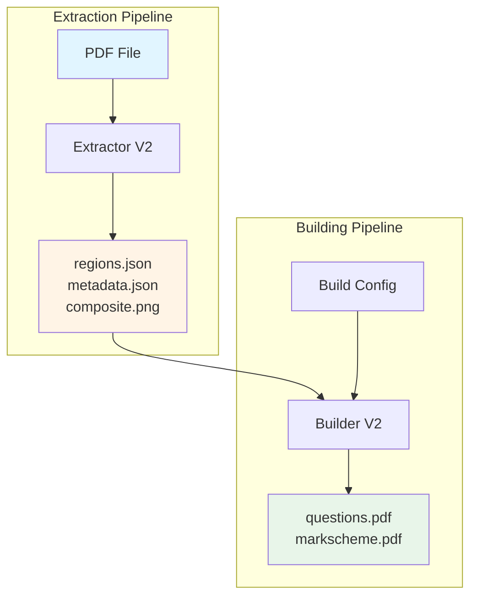

# GCSE Test Builder V2 Architecture

Welcome to the GCSE Test Builder V2 architecture documentation. This directory provides comprehensive documentation of the system architecture, pipelines, and implementation details.

## 📚 Navigation

### Getting Started
- **[Architecture Overview](overview.md)** - High-level system design and components
- **[Pipeline Guide](pipelines.md)** - Complete extraction and building pipelines
- **[Data Models](data-models.md)** - Core data structures and their relationships

### Implementation Details
- **[Extractor V2](extractor-v2.md)** - Question extraction pipeline (PDF → JSON)
- **[Builder V2](builder-v2.md)** - Exam building pipeline (JSON → PDF)
- **[Function Index](function-index.md)** - Public function reference
- **[GUI V2](../../src/gcse_toolkit/gui_v2/README.md)** - Desktop application architecture
- **[Plugin System](../../src/gcse_toolkit/plugins/README.md)** - Exam plugin documentation

### Development
- **[Testing Guide](testing.md)** - Test organization and coverage
- **[Dependencies](dependencies.md)** - External and internal dependencies
- **[Decision Log](decision_log.md)** - Key architectural decisions
- **[V2 Design Deviations](v2_deviations.md)** - How V2 differs from V1

## Quick Links

| Pipeline | Entry Point | Output |
|----------|-------------|--------|
| **Extraction** | `extract_question_paper()` | `regions.json`, `metadata.json`, `composite.png` |
| **Building** | `build_exam()` | `questions.pdf`, `markscheme.pdf` |

## Architecture Principles

1. **Immutability** - Data models are frozen dataclasses
2. **Separation of Concerns** - Clear module boundaries
3. **Testability** - Pure functions where possible
4. **Type Safety** - Full type hints throughout
5. **Documentation** - Every module and function documented

## System Overview



## Directory Structure

```
src/gcse_toolkit/
├── core/
│   ├── models/          # Shared data models
│   └── schemas/         # JSON schemas and validation
├── extractor_v2/        # Extraction pipeline
├── builder_v2/          # Building pipeline
├── gui_v2/             # Desktop GUI (PySide6)
├── plugins/            # Exam-specific plugins
└── common/             # Shared internal libraries
```

### Common Utilities

Modules used throughout all pipelines:
- `common/bbox_utils.py`: Geometric operations on bounding boxes.
- `common/path_utils.py`: Cross-platform path resolution.
- `common/topics.py`: Topic and sub-topic name canonicalization.
- `common/thresholds.py`: Shared configuration for computer vision detection.

## See Also

- [Main README](../../README.md) - Installation and usage
- [Testing](testing.md) - How to run tests
- [Decision Log](decision_log.md) - Why things are built this way
