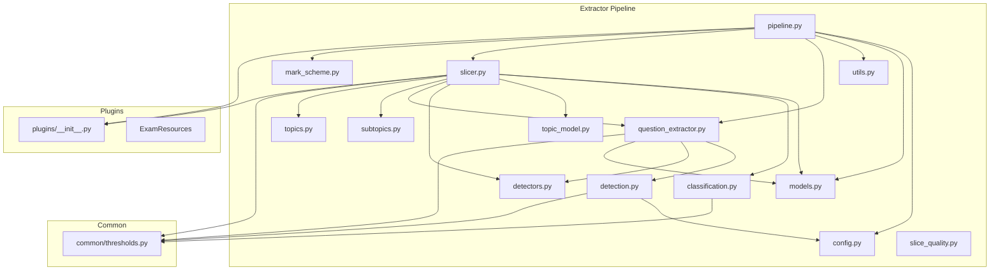
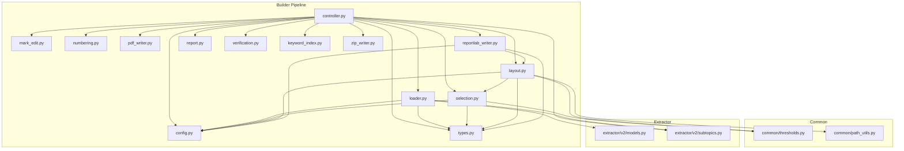
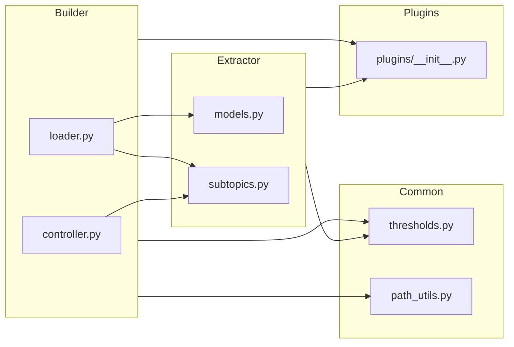

# Module Dependencies

> **Document Type:** CURRENT ARCHITECTURE  
> **Purpose:** Documents the existing codebase as-is for Phase 1 analysis  
> **See Also:** Proposed V2 changes are in `docs/TODO/d) Major Refactoring/30_builder_extractor_v2/`

## Overview

This document maps the dependency relationships between modules in the extractor and builder pipelines. Understanding these relationships is essential for the V2 refactor.

---

# CURRENT STATE

## Extractor Module Dependencies

### Import Details: pipeline.py

| Imported From | Imported Items |
|---------------|----------------|
| `.config` | `ExtractorConfigV2` |
| `.models` | `ExamPaper` |
| `.utils` | `exam_code` (as detect_exam_code) |
| `.question_extractor` | `QuestionExtractorV2`, `QuestionBundle` |
| `.slicer` | `QuestionSlicer`, `_extract_year_from_series` |
| `.mark_scheme` | `MarkSchemeSaver` |
| `gcse_toolkit.plugins` | `ExamResources`, `load_exam_resources`, `UnsupportedCodeError`, `MissingResourcesError` |

### Import Details: slicer.py

| Imported From | Imported Items |
|---------------|----------------|
| `gcse_toolkit.common.thresholds` | `IMAGE_THRESHOLDS`, `LAYOUT_THRESHOLDS`, `SECTION_THRESHOLDS`, `TEXT_LAYOUT_THRESHOLDS` |
| `.models` | `ExamPaper`, `METADATA_SCHEMA_VERSION` |
| `.classification` | `extract_command_words`, `infer_response_type` |
| `.topic_model` | `TopicModel` |
| `.detectors` | `Detection` |
| `.question_extractor` | `QuestionBundle`, `is_footer_metadata_text` |
| `.subtopics` | `classify_sub_topics`, `resolve_topic_label`, `normalise_topic_label`, `FALLBACK_SUB_TOPIC` |
| `.topics` | `topic_patterns` |
| `gcse_toolkit.plugins` | `ExamResources`, `load_exam_stats` |

---

## Builder Module Dependencies

### Import Details: controller.py

| Imported From | Imported Items |
|---------------|----------------|
| `.config` | `BuilderConfig` |
| `.keyword_index` | `KeywordIndex` |
| `.selection` | `SelectionResult` |
| `.types` | `QuestionRecord` |
| `.` (internal modules) | `loader`, `selection`, `layout`, `mark_edit`, `numbering`, `pdf_writer`, `report`, `verification`, `reportlab_writer` |
| `gcse_toolkit.extractor.v2.subtopics` | `resolve_topic_label`, `topic_sub_topics` |

### Import Details: loader.py

| Imported From | Imported Items |
|---------------|----------------|
| `.config` | `BuilderConfig` |
| `.types` | `BBox`, `PartNode`, `QuestionRecord` |
| `gcse_toolkit.extractor.v2.models` | `METADATA_SCHEMA_VERSION` |
| `gcse_toolkit.extractor.v2.subtopics` | `canonical_sub_topic_label` |

### Import Details: selection.py

| Imported From | Imported Items |
|---------------|----------------|
| `gcse_toolkit.common.thresholds` | `SELECTION_THRESHOLDS` |
| `.config` | `BuilderConfig`, `normalise_topic` |
| `.types` | `PartNode`, `QuestionRecord` |

### Import Details: layout.py

| Imported From | Imported Items |
|---------------|----------------|
| `gcse_toolkit.common.thresholds` | `LAYOUT_RENDER_THRESHOLDS` |
| `gcse_toolkit.common.path_utils` | `part_tokens` |
| `.config` | `BuilderConfig`, `PAGE_HEIGHT_PX`, `PAGE_WIDTH_PX` |
| `.selection` | `PlanOption`, `SelectionResult` |
| `.types` | `PartNode`, `QuestionRecord` |

---

## Cross-Module Dependencies

The following diagram shows dependencies that cross the extractor/builder boundary:

---

## Key Observations

### Tight Coupling Issues

1. **Loader → Extractor Models**
   - `loader.py` imports `METADATA_SCHEMA_VERSION` directly from extractor
   - Creates tight coupling between extraction format and build pipeline

2. **Controller → Extractor Subtopics**
   - `controller.py` imports topic resolution functions from extractor
   - This logic should be in a shared location

3. **Selection → Config Normalization**
   - `normalise_topic` is defined in config.py but used heavily in selection.py
   - Normalization logic should be centralized

---

# PROPOSED V2 CHANGES

### Opportunities for V2

1. **Create `core/` module** for shared models and utilities:
   - Move `Marks`, `SliceBounds`, `Part` models to `core/models/`
   - Move normalization functions to `core/utils/`

2. **Decouple extractor and builder**:
   - Define stable schema interface in `core/schemas/`
   - Builder only depends on schema, not extractor internals

3. **Consolidate thresholds**:
   - Already in `common/thresholds.py` - good separation
   - Continue using for V2

---

## File Size Summary

| Module | File | Lines | Complexity |
|--------|------|-------|------------|
| Extractor | pipeline.py | 414 | Medium |
| Extractor | detection.py | 295 | Low |
| Extractor | slicer.py | 1262 | **High** |
| Extractor | models.py | ~100 | Low |
| Builder | controller.py | 551 | Medium |
| Builder | loader.py | 330 | Medium |
| Builder | selection.py | 1220 | **High** |
| Builder | layout.py | 503 | Medium |
| Builder | types.py | ~200 | Low |

**Note:** `slicer.py` (1262 lines) and `selection.py` (1220 lines) are the most complex modules and primary targets for refactoring.
