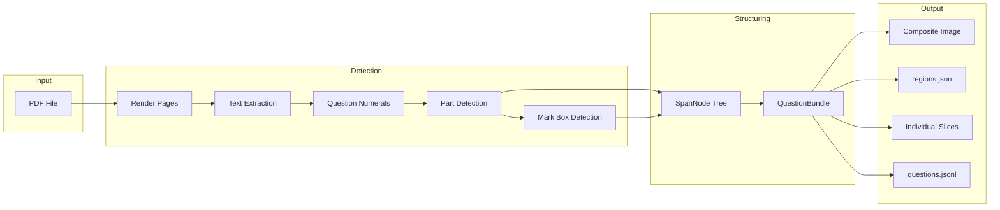
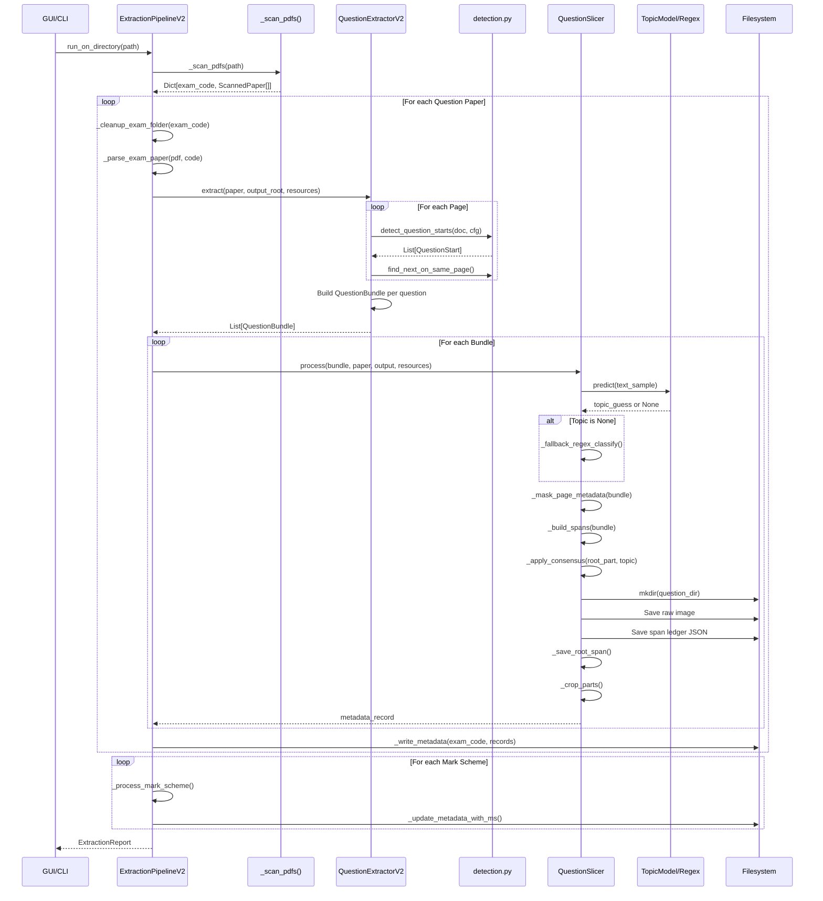
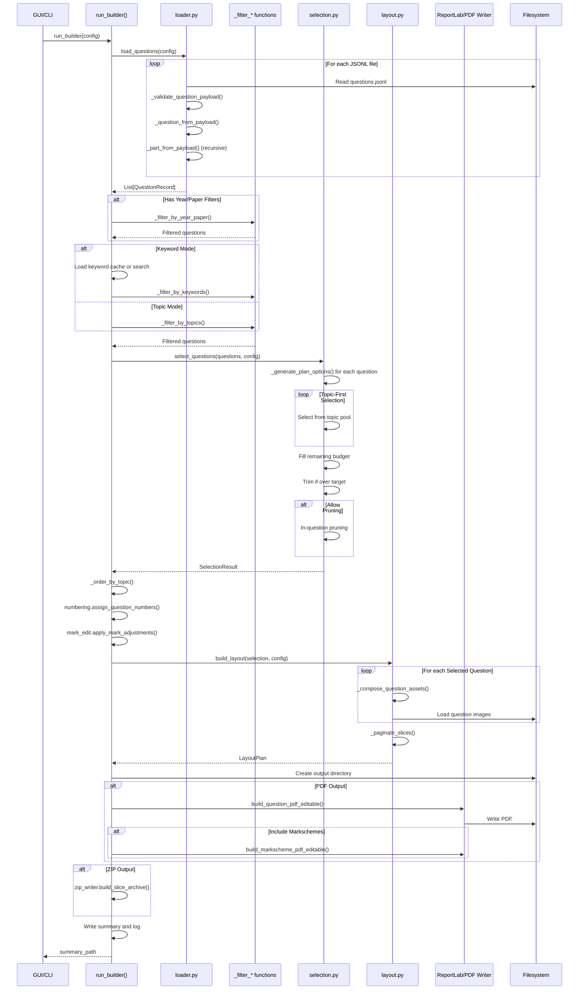

# Data Flow Diagrams

> **Document Type:** CURRENT ARCHITECTURE  
> **Purpose:** Documents existing data flows as-is for Phase 1 analysis  
> **See Also:** Proposed V2 changes are in `docs/TODO/d) Major Refactoring/30_builder_extractor_v2/`

## Overview

This document provides detailed sequence diagrams showing data flow through the extraction and building pipelines. Understanding these flows is essential for the V2 refactor.

---

# CURRENT DATA FLOWS

## Extraction Pipeline

### High-Level Flow



### Detailed Sequence Diagram



### Data Transformations

| Step | Input | Output | Key Transformation |
|------|-------|--------|-------------------|
| 1. Render | PDF path | Page images | PyMuPDF renders at configured DPI |
| 2. Detect | Page images, text | QuestionStart[] | Regex finds question numbers |
| 3. Bundle | QuestionStart[] | QuestionBundle[] | Groups pages per question |
| 4. Detect Parts | Bundle text | Detection[] | Finds (a), (i), etc. |
| 5. Detect Marks | Bundle image | MarkBox[] | OCR for mark boxes |
| 6. Build Spans | Detection[], Marks | SpanNode tree | Hierarchical structure |
| 7. Classify | Text sample | Topic label | ML model or regex fallback |
| 8. Save | SpanNode tree | PNG files + JSONL | Crops and writes per part |

---

## Building Pipeline

### High-Level Flow

```mermaid
flowchart LR
    subgraph Input
        Cache[Slices Cache]
        Config[BuilderConfig]
    end

    subgraph Loading
        Cache --> Loader[load_questions]
        Loader --> Records[QuestionRecord[]]
    end

    subgraph Filtering
        Records --> YearFilter[Year/Paper Filter]
        YearFilter --> TopicFilter[Topic Filter]
        TopicFilter --> Filtered[Filtered Questions]
    end

    subgraph Selection
        Filtered --> Options[Generate Options]
        Options --> Select[Knapsack Selection]
        Select --> Result[SelectionResult]
    end

    subgraph Layout
        Result --> Compose[Compose Assets]
        Compose --> Paginate[Page Layout]
        Paginate --> Pages[PagePlan[]]
    end

    subgraph Output
        Pages --> Writer[PDF/ZIP Writer]
        Writer --> PDF[Output Files]
    end
```

### Detailed Sequence Diagram



### Mark Calculation Flow

This is a critical flow showing how marks propagate through the system.

```mermaid
flowchart TD
    subgraph Extraction
        MarkBox[Mark Box Detection]
        MarkBox -->|OCR "[2]"| MarkValue[marks: List[int]]
        MarkValue --> SpanNode
    end

    subgraph Loading
        SpanNode -->|JSON| PartPayload[parts JSON]
        PartPayload -->|parse| PartNode
        PartNode -->|marks field| LoadedMarks[marks: Optional[int]]
    end

    subgraph Selection
        LoadedMarks --> LeafMark[_part_mark(leaf)]
        LeafMark --> OptionMarks[PlanOption.marks]
        OptionMarks --> SelectionMarks[SelectionResult.total_marks]
    end

    subgraph Problems
        TotalMarks[metadata.total_marks] -.->|Often wrong!| Problem1((Mismatch))
        OptionMarks -.->|Calculated 3 ways| Problem2((Inconsistent))
    end
```

**Mark Calculation Bug:**
- `total_marks` in metadata is often wrong (stored, not calculated)
- `PlanOption.marks` is calculated differently in different code paths
- No single source of truth for mark values

**V2 Solution:**
```python
# Marks are ALWAYS calculated from leaves
@cached_property
def total_marks(self) -> int:
    return sum(leaf.marks.value for leaf in self.iter_leaves())
```

---

## Data Structures at Each Stage

### Stage 1: PDF Parsing

```python
# Input
pdf_path: Path  # "0478_s21_qp_12.pdf"

# Output
QuestionStart(
    qnum=1,
    page=0,
    y=245.5,
    x=42.0,
    text="1",
    bbox=(38, 240, 55, 260)
)
```

### Stage 2: Bundle Creation

```python
# Input
starts: List[QuestionStart]

# Output
QuestionBundle(
    qnum=1,
    pages=[0, 1],
    raw_image=<PIL.Image 1654x2339>,
    marks=[MarkBox(label="2", bbox=(...)), ...],
    letters=[Detection(label="a", bbox=(...)), ...],
    romans=[Detection(label="i", bbox=(...)), ...],
    text_spans=[(y0, y1, "text"), ...],
    full_text="Complete question text..."
)
```

### Stage 3: Span Tree

```python
# Input
bundle: QuestionBundle

# Output
spans = {
    ("1",): SpanNode(kind="question", top=0, bottom=500, marks=[]),
    ("1", "a"): SpanNode(kind="letter", top=120, bottom=350, marks=[]),
    ("1", "a", "i"): SpanNode(kind="roman", top=200, bottom=280, marks=[2]),
    ("1", "a", "ii"): SpanNode(kind="roman", top=280, bottom=350, marks=[3]),
    ("1", "b"): SpanNode(kind="letter", top=350, bottom=500, marks=[4]),
}
```

### Stage 4: Metadata Record

```python
# Written to questions.jsonl
{
    "_schema_version": 6,
    "filename": "s21_qp_12_q1.png",
    "relative_path": "01. Data Representation/s21_qp_12_q1/1/s21_qp_12_q1.png",
    "main_topic": "01. Data Representation",
    "year": 2021,
    "paper_no": 1,
    "total_marks": 9,
    "parts": [
        {
            "label": "1",
            "topic": "01. Data Representation",
            "marks": null,
            "mark_source": "aggregate",
            "aggregate_marks": 9,
            "children": [...]
        }
    ]
}
```

### Stage 5: Question Record (Builder)

```python
QuestionRecord(
    question_id="s21_qp_12_q1",
    main_topic="01. Data Representation",
    total_marks=9,  # Often wrong!
    question_image=Path("slices_cache/0478/01. Data Representation/s21_qp_12_q1/1/s21_qp_12_q1.png"),
    parts=[
        PartNode(
            label="1",
            marks=None,
            aggregate_marks=9,
            children=[
                PartNode(label="1(a)", marks=None, children=[
                    PartNode(label="1(a)(i)", marks=2, children=[]),
                    PartNode(label="1(a)(ii)", marks=3, children=[]),
                ]),
                PartNode(label="1(b)", marks=4, children=[]),
            ]
        )
    ]
)
```

### Stage 6: Selection Result

```python
SelectionResult(
    items=[
        SelectedQuestion(
            option=PlanOption(
                question=<QuestionRecord>,
                root=<PartNode>,
                kept_leaves=(PartNode("1(a)(i)"), PartNode("1(a)(ii)"), PartNode("1(b)")),
                removed_leaves=(),
                marks=9,  # Sum of kept leaf marks
                covered_topics=frozenset({"01. Data Representation"}),
            ),
            adjustments=[],
        ),
        # ... more questions
    ],
    total_marks=47,
    target=50,
    tolerance=5,
)
```

### Stage 7: Layout Plan

```python
LayoutPlan(
    pages=[
        PagePlan(
            index=0,
            placements=[
                SlicePlacement(
                    asset=SliceAsset(
                        question_id="s21_qp_12_q1",
                        part_label="1",
                        image=<PIL.Image>,
                        height=400,
                        width=800,
                    ),
                    top=50,
                ),
                # ... more placements
            ],
            height_used=1800,
        ),
        # ... more pages
    ],
    question_page_map={"s21_qp_12_q1": [0, 1]},
)
```

---

## Critical Integration Points

### 1. Extractor → Builder Interface

**File:** `questions.jsonl`

The builder depends entirely on the metadata format produced by the extractor.

**Schema Version:** 6 (enforced)

**Required Fields:**
- `filename`
- `relative_path`
- `main_topic`
- `parts`
- `year` (v6+)
- `paper_no` (v6+)

### 2. Part Image Discovery

**File:** `_discover_part_images()` in loader.py

The builder expects slice images in a specific directory structure:

```
{question_dir}/
  {qnum}/
    {prefix}_{qnum}.png              # Question root
    {letter}/
      {prefix}_{qnum}_{letter}_root.png  # Letter context
      {roman}/
        {prefix}_{qnum}_{letter}_{roman}.png  # Roman leaf
```

### 3. Topic Resolution

**Shared Code:** `extractor/v2/subtopics.py`

Both pipelines use `resolve_topic_label()` and `canonical_sub_topic_label()`.

**Issue:** Builder imports extractor code directly, creating tight coupling.

---

# PROPOSED V2 INTERFACE

## V2 Interface Design

### Proposed Stable Interface

```python
# core/schemas/question.py

@dataclass(frozen=True)
class QuestionV2:
    """Immutable question representation."""
    id: str
    exam_code: str
    year: int
    paper: int
    topic: str
    sub_topics: Tuple[str, ...]
    question_node: PartV2       # Top-level part, NOT called 'root'
    composite_path: Path
    regions_path: Path

    @cached_property
    def total_marks(self) -> int:
        """Always calculated from leaves."""
        return sum(leaf.marks.value for leaf in self.question_node.iter_leaves())
```

Builder only depends on this interface, not extractor internals.
