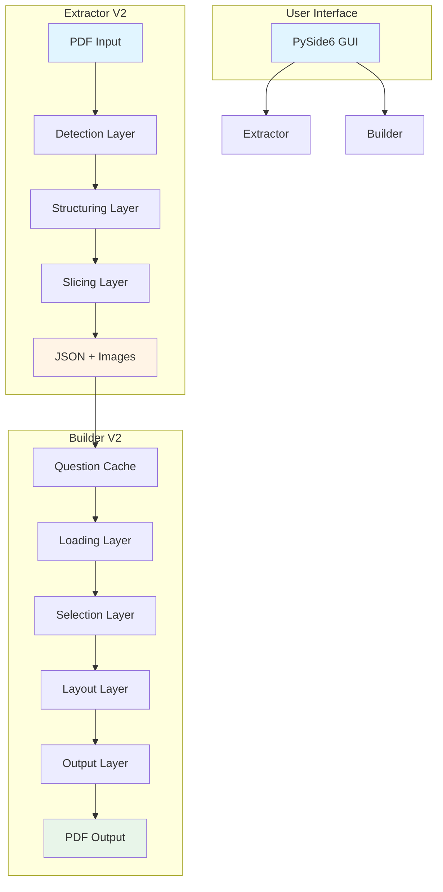

# Architecture Overview

High-level architecture of GCSE Test Builder V2 system design.

## System Architecture



## Component Chapters

### 1. Detection Phase
**Purpose**: Find question components in PDF pages. Located in `extractor_v2/detection/`.

**Modules**:
- `numerals.py` - Regex-based lookups for "1", "2", "3".
- `parts.py` - Identification of (a), (i) labels.
- `marks.py` - Computer vision detection of `[2]` mark boxes.

### 2. Structuring Phase
**Purpose**: Build hierarchical question tree. Located in `extractor_v2/structuring/`.

**Modules**:
- `tree_builder.py` - Assembles detections into a `Part` hierarchy.

### 3. Slicing Phase
**Purpose**: Calculate bounding boxes and generate output. Located in `extractor_v2/slicing/`.

**Modules**:
- `bounds_calculator.py` - Determines vertical boundaries for every node.
- `compositor.py` - Combines vertical slices into a single `composite.png`.
- `writer.py` - Saves all JSON and image data to the cache.

### 4. Loading Phase
**Purpose**: Reconstruct models from the filesystem. Located in `builder_v2/loading/`.

**Modules**:
- `loader.py` - Top-level reconstruction logic.
- `reconstructor.py` - Rebuilds the nested `Part` tree.

### 5. Selection Phase
**Purpose**: Choose questions to meet mark and topic targets. Located in `builder_v2/selection/`.

**Modules**:
- `selector.py` - DP Knapsack solver for question selection.
- `options.py` - Generates selection permutations (Full vs. Partially pruned questions).

### 6. Layout Phase
**Purpose**: Arrange assets on A4 pages. Located in `builder_v2/layout/`.

**Modules**:
- `composer.py` - Performs cropping and context preservation (headers).
- `paginator.py` - Fits slices onto pages respecting margins.

### 7. Output Phase
**Purpose**: Generate final files. Located in `builder_v2/output/`.

**Modules**:
- `renderer.py` - PDF generation.
- `zip_writer.py` - Standalone image packaging.
- `markscheme.py` - Answer key generation.

## Data Flow Principles

### Immutability
All core data models are frozen dataclasses in `core/models/`. This ensures thread safety and removes "spooky action at a distance" bugs common in V1.

### Calculated Aggregates
Marks are **never** stored as totals. They are always calculated recursively from leaf parts:
```python
@property
def total_marks(self):
    return sum(leaf.marks.value for leaf in self.iter_leaves())
```

### Decoupled Layout
Calculated bounds in `Extractor` are raw pixel values. Visual padding and margins are the responsibility of the `Builder` layout engine.

## Technology Stack

- **GUI**: PySide6 (Qt)
- **PDF Core**: PyMuPDF (fitz)
- **Computer Vision**: EasyOCR / Pillow
- **Rendering**: ReportLab
- **Testing**: Pytest / Mypy

## Directory Structure

```
src/gcse_toolkit/
├── core/Models         # Shared data models
├── extractor_v2/       # Extraction pipeline
├── builder_v2/         # Building pipeline
├── gui_v2/            # Desktop application
├── plugins/           # Exam board configuration
└── common/            # Shared geometry and path utilities
```

For more details on specific pipelines, see [Pipeline Documentation](pipelines.md).
