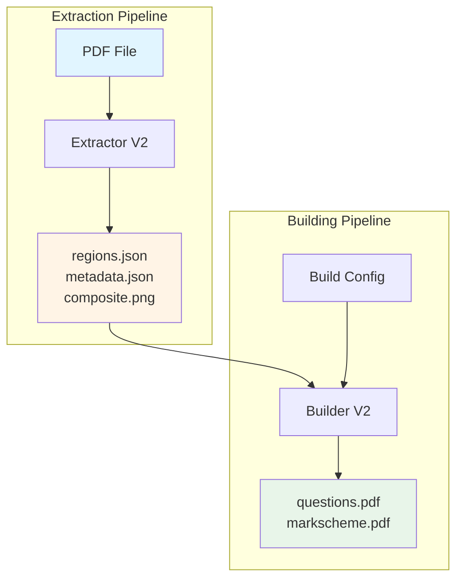

# Pipeline Documentation

This document provide a high-level overview of the two primary pipelines in GCSE Test Builder: **Extraction** and **Building**.

## Overview

---

## 1. Extraction Pipeline

The extraction pipeline converts PDF question papers into structured JSON data with image slices.

**Input**: PDF file (e.g., `0478_m24_qp_12.pdf`)  
**Output**: 
- `regions.json` - Bounding boxes for all parts
- `metadata.json` - Question metadata and hierarchy
- `composite.png` - Full question composite image

**[→ Detailed Extraction Documentation](extractor-v2.md)**

---

## 2. Building Pipeline

The building pipeline creates customized exam PDFs from extracted questions.

**Input**: 
- Extracted question cache
- `BuilderConfig` with selection criteria

**Output**:
- `questions.pdf` - Question paper
- `markscheme.pdf` - Mark scheme (optional)

**[→ Detailed Building Documentation](builder-v2.md)**

---

## Data Flow Summary

### Extraction Flow
`PDF` → `Render` → `OCR` → `Detect` → `Structure` → `Slicing` → `Cache`

### Building Flow
`Cache` → `Load` → `Filter` → `Select` → `Compose` → `Paginate` → `Render PDF`

---

## See Also

- [Data Models](data-models.md) - Core data structures
- [Testing Guide](testing.md) - How to verify pipeline changes
